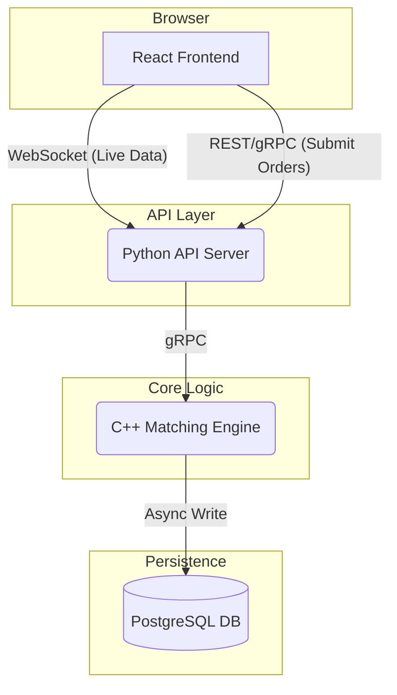

# Aether: High-Performance Equity Matching Engine

## 1. System Overview

This project is a high-performance, low-latency equity order matching engine. It is designed to simulate the core functionality of a modern financial exchange, processing new orders, maintaining a live order book, and executing trades with microsecond-level performance. The system is architected for scalability and observability, providing a real-time view of market activity through a web-based interface. The primary goal is to process over 100,000 orders per second on a single node with p99 latency below 100 microseconds for order processing.

## 2. Component Diagram



## 3. Core data models
```cpp
enum class OrderSide { BUY, SELL };
enum class OrderType { LIMIT, MARKET };

struct Order {
    uint64_t orderId;
    uint64_t securityId;
    OrderSide side;
    OrderType type;
    double price; // Only for LIMIT orders
    uint32_t quantity;
    uint64_t timestamp;
};
```

```cpp
struct Trade {
    uint64_t tradeId;
    uint64_t securityId;
    double price;
    uint32_t quantity;
    uint64_t aggressingOrderId;
    uint64_t restingOrderId;
    uint64_t timestamp;
};
```

```
syntax = "proto3";

package aether;

// Service definition for the matching engine
service MatchingEngine {
    // Submit a new order to the engine
    rpc SubmitOrder(OrderRequest) returns (OrderConfirmation);

    // Stream live trade executions for a given security
    rpc StreamTrades(StreamRequest) returns (stream Trade);

    // Stream live L2 order book snapshots for a given security
    rpc StreamOrderBook(StreamRequest) returns (stream OrderBookSnapshot);
}

// Enums for order properties
enum OrderSide {
    SIDE_UNKNOWN = 0;
    BUY = 1;
    SELL = 2;
}

enum OrderType {
    TYPE_UNKNOWN = 0;
    MARKET = 1;
    LIMIT = 2;
}

// Message definitions
message OrderRequest {
    uint64 security_id = 1;
    OrderSide side = 2;
    OrderType type = 3;
    uint32 quantity = 4;
    double price = 5; // Ignored for MARKET orders
}

message OrderConfirmation {
    uint64 order_id = 1;
    bool accepted = 2;
    string reason = 3; // e.g., "Accepted", "Insufficient funds"
}

message StreamRequest {
    uint64 security_id = 1;
}

message Trade {
    uint64 trade_id = 1;
    uint64 security_id = 2;
    double price = 3;
    uint32 quantity = 4;
    int64 timestamp_ns = 5; // Nanosecond epoch time
}

message OrderBookLevel {
    double price = 1;
    uint32 aggregate_quantity = 2;
}

message OrderBookSnapshot {
    uint64 security_id = 1;
    repeated OrderBookLevel bids = 2;
    repeated OrderBookLevel asks = 3;
    int64 timestamp_ns = 4;
}
```