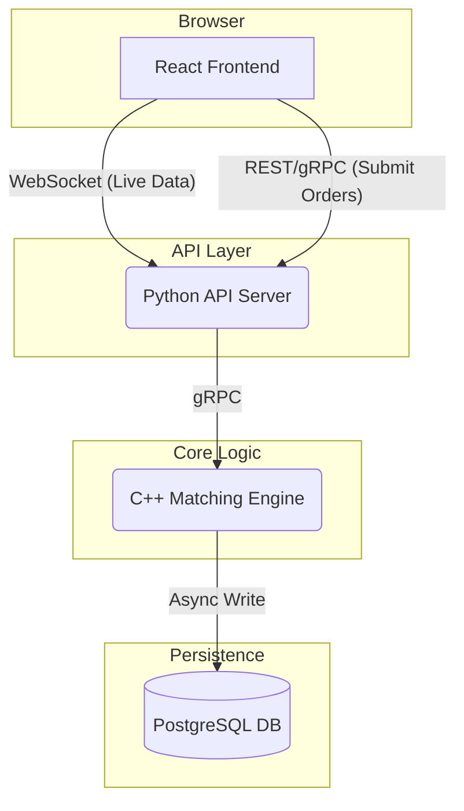

> This project is still under active development!
# Aether: High-Performance Equity Matching Engine

This project is a high-performance, low-latency equity order matching engine. It is designed to simulate the core functionality of a modern financial exchange, processing new orders, maintaining a live order book, and executing trades with microsecond-level performance. The system is architected for scalability and observability, providing a real-time view of market activity through a web-based interface. The primary goal is to process over 100,000 orders per second on a single node with p99 latency below 100 microseconds for order processing.

## Under The Hood -- High Level Overview
The entire system is very modular in nature, the Aether engine written in pure C++23 can stand completely alone and be interfaced with just a terminal. It is optimised and designed purely for speed and efficieny so it is assumed when an order is submitted to the engine that the order is valid. The engine is interfaced with using gRPC so Aether is a distributed system. The gRPC server is responsible for validating orders, connecting the gateway to the engine and providing the services to place orders, and relay the data back (either with streaming via Web Sockets or just a simple Protobuf response). The Python gateway created using FastAPI is responsible for connecting the gRPC server with the React frontend, it validates all input, translates all data (either streaming or just simple data) from gRPC responses/calls to Protobuf to JSON and vice-versa. The React frontend then just displays/updates this data and sends requests to the gateway. Each of these components can be thought of as smaller, seperate projects which all come together to create the entire Aether project.

## Component Diagram



## Documentation
If you are not familiar or well versed with finance, and in particular matching engines, then you can read in the `/docs` directory all the background information required to understand technology behind Aether. There are also design decisions, discussion of tradeoffs, benchmark results, etc.

## Building
Ensure that gRPC has been installed in some appropriate location. You do not need to the `CMAKE_POLICY_VERSION_MINIMUM=3.5` if you are using CMake < 4.0
```bash
rm -rf build
cmake -S . -B build -DCMAKE_PREFIX_PATH="$HOME/.local/grpc_install"
cmake --build build -j
```