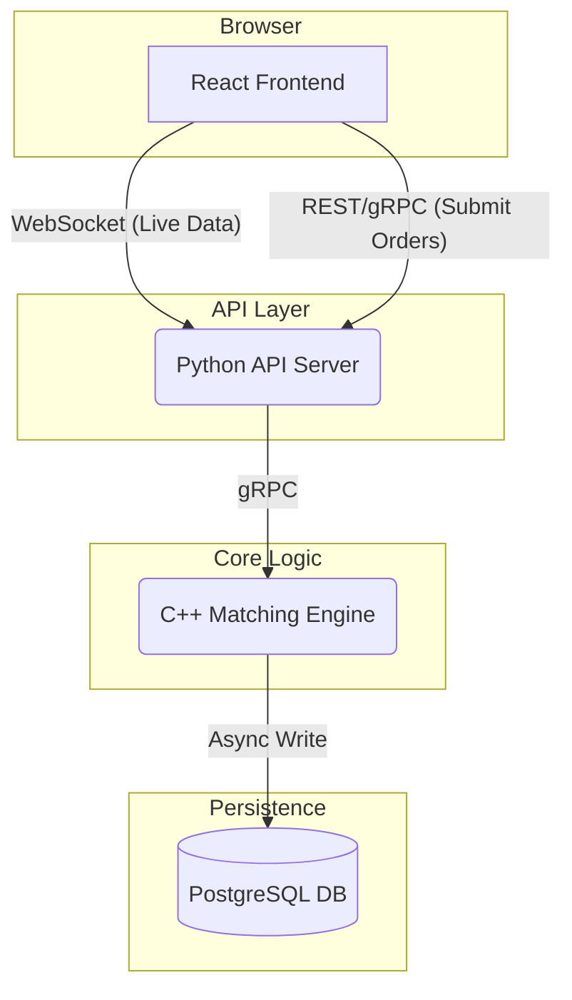

# Aether: High-Performance Equity Matching Engine

This project is a high-performance, low-latency equity order matching engine. It is designed to simulate the core functionality of a modern financial exchange, processing new orders, maintaining a live order book, and executing trades with microsecond-level performance. The system is architected for scalability and observability, providing a real-time view of market activity through a web-based interface. The primary goal is to process over 100,000 orders per second on a single node with p99 latency below 100 microseconds for order processing.

## Component Diagram



## Building
Ensure that gRPC has been installed in `$MY_INSTALL_DIR` or some other appropriate location. You do not need to the `CMAKE_POLICY_VERSION_MINIMUM=3.5` if you are using CMake < 4.0
```bash
mkdir -p build && cd build
cmake -DCMAKE_PREFIX_PATH=$HOME/.local/grpc_install ..
cmake --build build
```