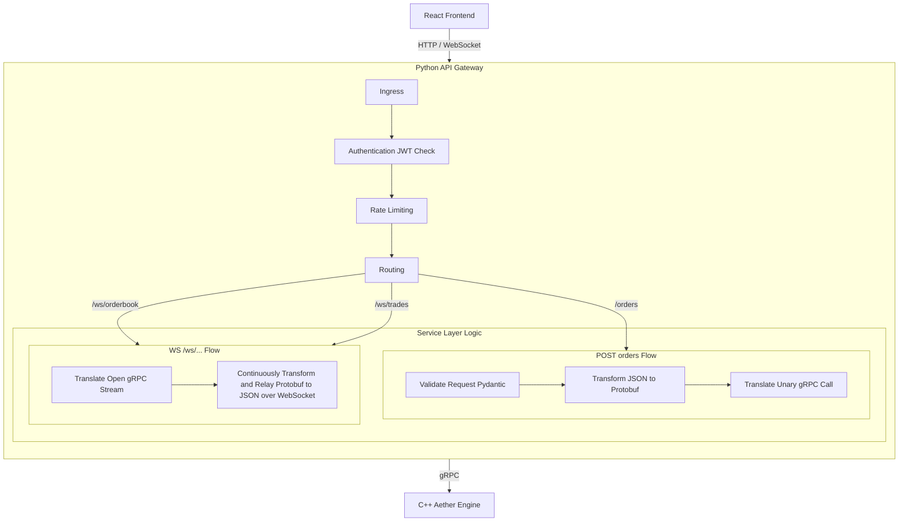

## Assuming in `/api/app`
```python
cd generated
python3 -m grpc_tools.protoc -I../../protos --python_out=. --pyi_out=. --grpc_python_out=. ../../protos/*.proto
```


```mermaid
flowchart TD
    %% Define the high-level actors and their communication
    RF[React Frontend] -- HTTP / WebSocket --> Gateway
    Gateway -- gRPC --> AE[C++ Aether Engine]

    %% Define the internal components and flow of the Gateway
    subgraph Gateway [Python API Gateway]
        direction TB

        %% Gatekeeper Pipeline
        Ingress --> AuthN[Authentication JWT Check]
        AuthN --> RL[Rate Limiting]
        RL --> Router[Routing]

        %% Core Logic, handled by the Service Layer
        subgraph ServiceLayer [Service Layer Logic]
            direction TB

            subgraph PostPath [POST orders Flow]
                direction LR
                V1[Validate Request Pydantic] --> T1[Transform JSON to Protobuf] --> PT1[Translate Unary gRPC Call]
            end

            subgraph WebSocketPath [WS /ws/... Flow]
                direction LR
                PT2[Translate Open gRPC Stream] --> T2[Continuously Transform and Relay Protobuf to JSON over WebSocket]
            end
        end
        
        %% Connect Routing to the specific logic paths
        Router -- "/orders" --> PostPath
        Router -- "/ws/orderbook" --> WebSocketPath
        Router -- "/ws/trades" --> WebSocketPath
    end
```